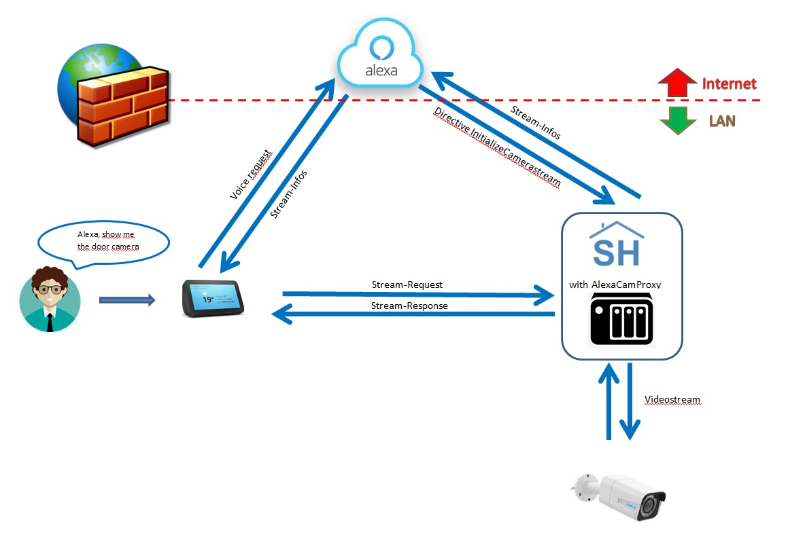

# AlexaCamProxy - Version 1.0.0
# Multi-Threading Camera-Proxy for Alexa4P3-Plugin


## Table of Content
1. [How it works](#howitworks) <sup><span style="color:red"> **Neu**</sup></span>
2. [ChangeLog](#ChangeLog) <sup><span style="color:red"> **Neu**</sup></span>
3. [Configuration](#config) <sup><span style="color:red"> **Neu**</sup></span>
4. [Communication scheme](#scheme) <sup><span style="color:red"> **Neu**</sup></span>


## What the Plugin do :

The Plugin provides private Cameras in the local network for Amazon devices like Echo Show / Echo Spot / FireTV. The reqirements of Amazon for cameras are :

- encrypted Connection via TLSv1.2
- use an officiel certificate (not self signed)
- using Port 443

So it´s not possible to use private cameras (on local networks) without any cheats,
this plugin will fix this problem

## How it works: <a name="howitworks"/></a>

The plugin provides a socket on Port 443 and listens to incoming connections. If there is a request to a proxied camera the plugin injects the real URL of the stream in the request, creates a second socket and connects to the camera.
If "proxy_Url" is set only Connections from the own IP-Adress will be accepted.


## Change-Log <a name="ChangeLog"/></a>

#### 2018.03.03 - Version 1.0.0

- added Support for Basic/Digest Authentication to the CamProxy
- added Access only for restricted / own public IP (new Parameter in plugin.yaml "proxy_url")

#### 2018.01.26 - launch of Version 1.0.0

- Beta Version for tests distributed


## Requirements

Nothing special needed, see Needed software

### Needed software

* running Plugin Alexa4P3
* SmartHomeNG >= 1.5.2
* Python >= 3.0
* for the WebInteface you need the http-module of SmartHomeNG
* SmartHomeSkill with Payload V3 in Amazon Developer Console
* working Lambda function in Amazon AWS
* running Nginx with guilty certificate (official not self signed)
* public URL via DYNDNS-Service
* reachable Port 443 (you have to move NGINX to another Port)
* Portforwarding on your router for Port 443 to your SmartHomeNG machine


## <span style="color:red">**!! Needed Access for the ProxyCam4AlexaP3 on Port 443 !!**</span>

<span style="color:red">**You have to give the Plugin access to Port 443. To do this you have to give Python permissions to bind privileged ports without root access.To setup this run the following command.It´s not allowed to Bind Symlinks. So after a update of the used Python version you have to do this again.(Python3 -> Symlink to python 3.5 after Update Python3 -> Symlink to python 3.6)**</span>

## <span style="color:red">**=================================================**</span>
<pre><code>sudo setcap CAP_NET_BIND_SERVICE=+eip /usr/bin/python3.5
</code></pre>
## <span style="color:red">**=================================================**</span>


## Supported Hardware

* all Cameras with RTSP-Protocoll and Handling OPTIONS/DESCRIBE/PLAY/TEARDOWN

## Configuration<a name="config"/></a>

## plugin.yaml

The plugin has the following paramters in the plugin.yaml

```yaml
AlexaCamProxy4P3:
    class_name: AlexaCamProxy4P3
    class_path: plugins.alexacamproxy4p3
    port: 443
    video_buffer: 524280
    cert_path: '/usr/local/smarthome/plugins/alexacamproxy4p3/fullchain.pem'
    cert_path_key: '/usr/local/smarthome/plugins/alexacamproxy4p3/privkey.pem'
    proxy_url: '<your.domain.net>'
    proxy_credentials: '<user>:<pwd>'
    proxy_auth_type: 'DIGEST'
    only_allow_own_IP: true
```

<strong>Please do not use "proxy" in your proxy_credentials. On Test-Sockets the VLC-Player will get in trouble with it, because there is a special handling for "proxy:" in VLC-Player</strong>

cert_path : File with your fullchain.pem for the URL where you want to reach your  proxied cameras

cert_path_key : File with your privkey.pem for the URL.

video_buffer : Size for the Videobuffer for streaming. Standard is 524280 bytes. My experience was :
- too small buffer, you have to wait a long time till the stream starts
- too big buffer, the streams sometimes wait for the data

Please try out what value fits to your setup and Cam´s.

proxy_url : Your public DynDNS-URL. 

proxy_credentials: User:Password

proxy_auth_type : Authentification-Type for the Proxy allowed values "DIGEST", "BASIC" and "NONE".

onyl_allow_own_IP: If set to True the CameraProxy will only allow access from your own public IP, no other Client will get Access. If set to False also foreign IP-addresses will be accepted.


## items.yaml

No items or attributes have to be defined. On Startup the Plugin generates the needed attributes based on the attributes of the Alexpa4P3-Plugin.

In my point of view, no further description is needed

## Communication scheme <a name="scheme"/></a>


